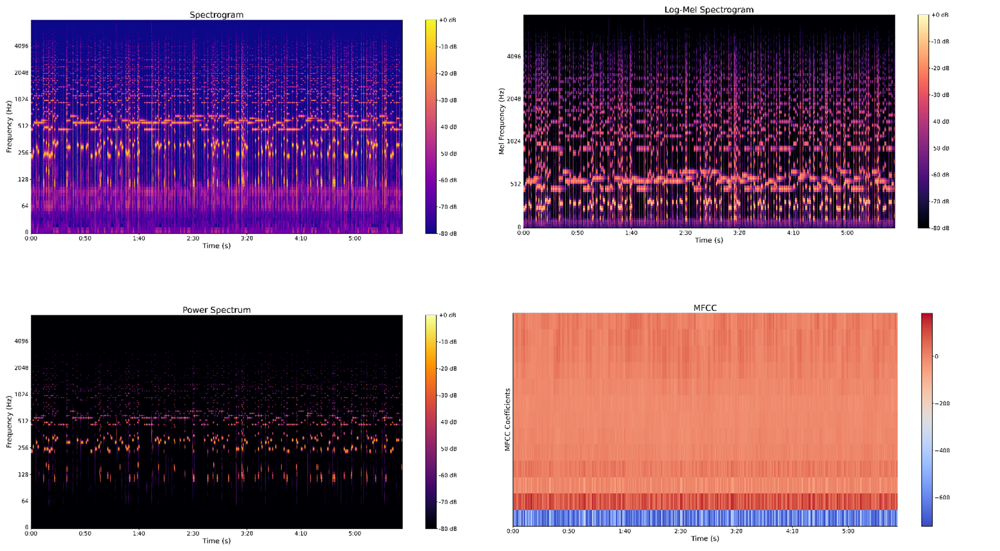
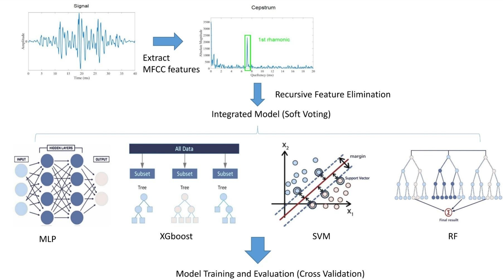
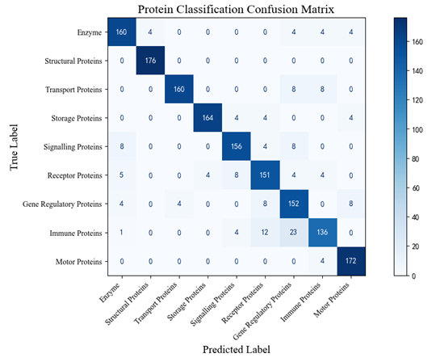
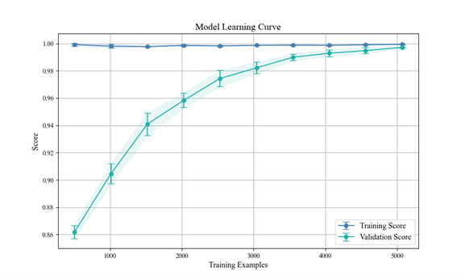

# **Symphony of Fate: Weaving Life through the Music of Amino Acids**

Author: 
Xu Wang1, 3, a*, Yiquan Wang2, 3, b, Yuhua Dong1, c, Chen Jin4, d

 

1. College of Communication Engineering, Jilin University, Changchun, Jilin, 130000, China 

2. College of Mathematics and System Science, Xinjiang University, Urumqi, Xinjiang, 830046, China

3. Shenzhen X-Institute, Shenzhen, China, 518055

4. College of Animal Science and Technology, Anhui Agricultural University, Hefei, Anhui, 230046, China

 

a. [wangxu2020@mails.jlu.edu.cn](mailto:wangxu2020@mails.jlu.edu.cn)   b. ethan@stu.xju.edu.cn

c. [dongyh2021@mails.jlu.edu.cn](mailto:dongyh2021@mails.jlu.edu.cn)   d. Jin_Chen_31@stu.ahau.edu.cn

## Dataset Source：

| **Types of Materials**  | **Sources**       | **URLs**                      |
| ----------------------- | ----------------- | ----------------------------- |
| Protein FASTA Sequences | NCBI Database     | https://www.ncbi.nlm.nih.gov/ |
|                         | UniProt Database  | https://www.uniprot.org/      |
| Kcat and km             | SABIO-RK Database | http://sabio.h-its.org/       |
|                         | EBI Database      | https://www.ebi.ac.uk/        |

## 1. ftow.py

**Function**: Converts amino acid FASTA sequences to WAV audio files and PNG spectrograms.

## 2. proteinml.py

**Function**: Machine learning for predicting protein functions and plotting learning curves.

## 3. proteinml_matrix.py

**Function**: Machine learning for predicting protein functions and plotting confusion matrices.

## 4. Tonnetz.py

**Function**: Calculates Tonnetz features and Pearson correlation coefficients.

#### **Introduction:**

In ancient Greek mythology, the three Fates governed the threads of life, weaving, measuring, and ultimately determining each person's destiny. Similarly, proteins, as the core executors of life’s processes, function through an intricate "web of fate," where sequence, structure, and function are intertwined. Traditional research methods, however, often focus on one-dimensional information, such as sequence or three-dimensional structure, limiting the understanding of these multifaceted relationships. To overcome this limitation, we propose an innovative interdisciplinary approach that translates protein sequence and structural information into musical encoding, enabling deeper exploration of the multidimensional functional relationships through spectral analysis. This method provides a novel perspective on dynamic information that is often elusive to conventional approaches, revealing profound patterns between protein function and structure.In our experiments, we utilized machine learning models such as multilayer perceptrons and XGBoost to analyze the musical spectra mapped from over 2,000 proteins, achieving a classification accuracy of 91.04% and a cross-validation score as high as 99.68%. Furthermore, the proposed harmony index in music encoding shows a significant correlation with protein functionality, such as enzymatic activity. This study offers new theoretical insights and inspiration for directed evolution and protein design, weaving, like the Fates, a symphony of life.

Figure 1. Schematic Diagram of the Mapping Rules

Figure 2: Schematic Diagram of Spectrum Analysis

Figure 3. Protein Function Prediction Flowchart

Figure 5. Classification confusion matrix for the 9 protein classes

Figure 6. Classification Prediction Model Learning Curve
